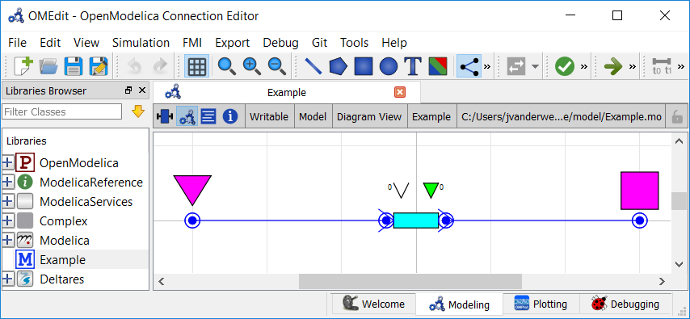
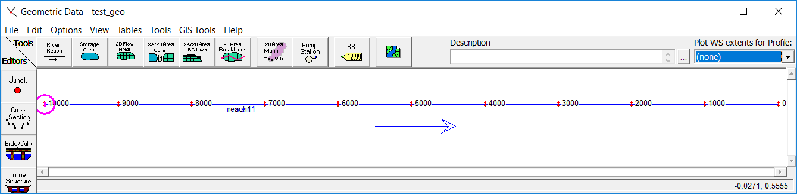
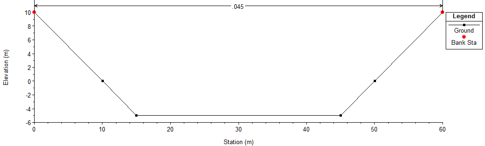

Modeling Waves in Rivers and Canals
~~~~~~~~~~~~~~~~~~~~~~~~~~~~~~~~~~~

.. image:: ../../images/Lake-Hartwell-24012016.jpg

.. :href: https://pixabay.com/en/pont-du-gard-aqueduct-roman-unesco-1742029/
.. pixabay content is released under a CC0 Public Domain licence - no attribution needed

.. note::

    This is a more advanced example that implements advanced channel hydraulics
    in RTC-Tools. It also capitalizes on the homotopy techniques available in
    RTC-Tools. If you are a first-time user of RTC-Tools, see :doc:`basic`.

The RTC-Tools is capable of handling non-linear hydraulics. In this example, we
model a river channel that receives a sudden pulse of higher-than-usual water
volumes. We compare the results to those of an identical model built in HEC-RAS.

The Model
---------

In this example, water is flowing through a single channel. There is an inflow
at the upstream end and a water level bound at the downstream end.

In OpenModelica Connection Editor, the model looks like this in plan view:

In text mode, the Modelica model looks as follows (with annotation statements
removed):

.. literalinclude:: ../../_build/mo/channel_pulse.mo
  :language: modelica
  :lineno-match:

The plan view of the model looks like this in HEC-RAS:

The channel cross-section is a simple trapezoidal shape. As rendered by HEC-RAS,
here is a cross-section view of the channel being modeled:

The model was built with HEC-RAS version 5.0.6. In case you wish to verify the
HEC-RAS model yourself, a zip of the HEC-RAS model used in this comparison is
available: :download:`HEC-RAS.zip <../../../examples/channel_pulse/HEC-RAS.zip>`

The Python File
---------------

To keep this example simple and to allow for a 1:1 comparison with HEC-RAS, we
will not have any decision variables in this model. 

.. literalinclude:: ../../../examples/channel_pulse/src/example.py
  :language: python
  :lineno-match:

As you can see, this model is as simple as it gets. We only add a constraint to
keep the initialization states consistent with the HEC-RAS initialization.

Comparison of Numerical Schemes
-------------------------------

HEC-RAS and RTC-Tools use different numerical schemes:

   * RTC-Tools uses a staggered grid, whereas HEC-RAS uses a box scheme;
   * RTC-Tools provides a solution of the original nonlinear equations, whereas
     HEC-RAS uses a linearization technique to compute discharge and level
     increments.

Comparison of Results
---------------------

The results from the RTC-Tools run are found in the output directory with the
name ``timeseries_export.csv``, and the results generated by HEC-RAS have been
exported into the same directory under the name ``HEC-RAS_results.csv``. We can
compare the results using the Python library ``matplotlib``:

.. plot:: examples/pyplots/channel_pulse_results.py
